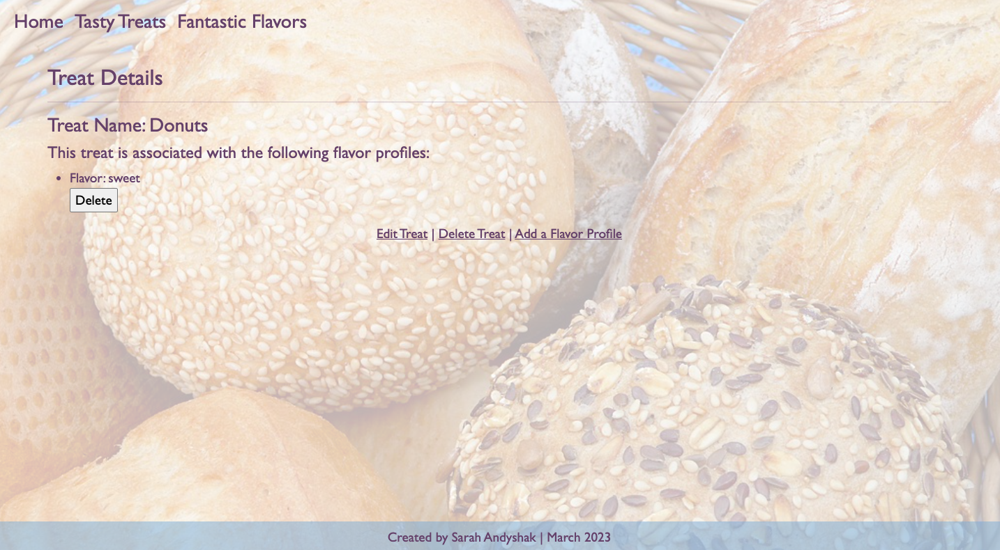
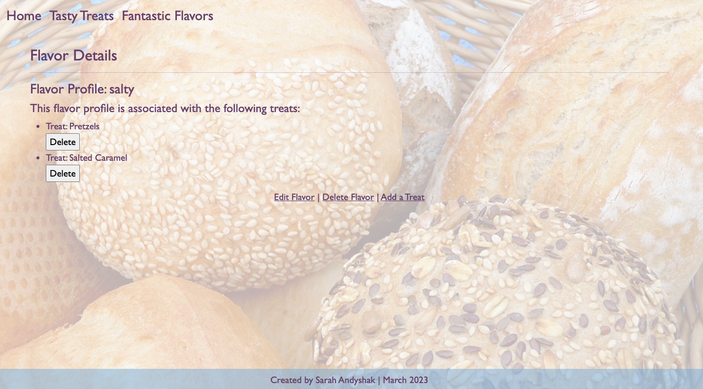

# 🥨 Pierre's Bakery 🥨

#### By Sarah Andyshak

#### An app for bakery patrons to view pastries, and for the owner to update the site.

## Technologies Used

* C#
* .NET
* HTML
* MVC
* SQL Workbench
* Entity Framework
* Identity Framework
* CSS

## Description

A website for a bakery to show off pastries by type and flavor. Made using C# exploring authentication, authorization, and many-to-many relationships during Week 12 of Epicodus Coding School.

Screenshots from the website:




## Setup/Installation Requirements

* This program was built using `Microsoft .NET SDK 6.0`, and may not be compatible with other versions.
1. Clone this repo.
2. Open your terminal (e.g., Terminal or GitBash) and navigate to this project's production directory called "PierresTreats."
3. Create an `appsetting.json` file in the production directory ("PierresTreats.")
4. Within `appsettings.json`, put in the following code, replacing the `uid` and `pwd` values with your own username and password for MySQL. 
```json
{
    "ConnectionStrings": {
        "DefaultConnection": "Server=localhost;Port=3306;database=library_catalog;uid=YOUR-USERNAME-HERE;pwd=YOUR-PASSWORD-HERE;"
    }
}
```
* If you'd like to push this cloned project to a public-facing repository, remember to add the appsettings.json file to your .gitignore first.
5. Create the project database using the migrations in the production directory. In your shell (e.g., Terminal or GitBash) navigate to the production directory "PierresTreats," and run `dotnet ef database update`. You may need to run this command for each of the branches in this repo if multiple branches have been created. 
    - Optional: to create a migration, run the command `dotnet ef migrations add MigrationName` where `MigrationName` is your custom name for the migration in UpperCamelCase. To learn more about migrations, visit the LHTP lesson [Code First Development and Migrations](https://www.learnhowtoprogram.com/c-and-net-part-time/many-to-many-relationships/code-first-development-and-migrations).
6. Open the browser to [https://localhost:5001]. If you cannot access localhost:5001 it is likely because you have not configured a .NET developer security certificate for HTTPS. To learn about this, review this lesson: [Redirecting to HTTPS and Issuing a Security Certificate.](https://www.learnhowtoprogram.com/c-and-net/basic-web-applications/redirecting-to-https-and-issuing-a-security-certificate)
* If you want to run the project in production mode with a watcher, you can use a command line flag to specify that you want to run the "production" profile. ``dotnet watch run --launch-profile "PierresTreats-Production"``
* To optionally further build out this project in development mode, start the project with `dotnet watch run` in the production directory "PierresTreats."

## Known Bugs

* No known issues.

## License
Enjoy the site! If you have questions or suggestions for fixing the code, please contact me!

[MIT](https://github.com/git/git-scm.com/blob/main/MIT-LICENSE.txt)

Copyright (c) 2023 Sarah Andyshak.